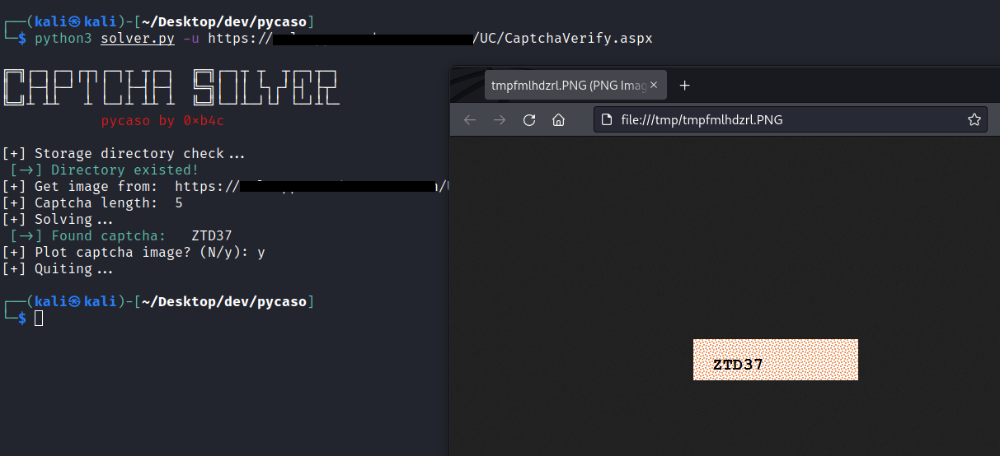
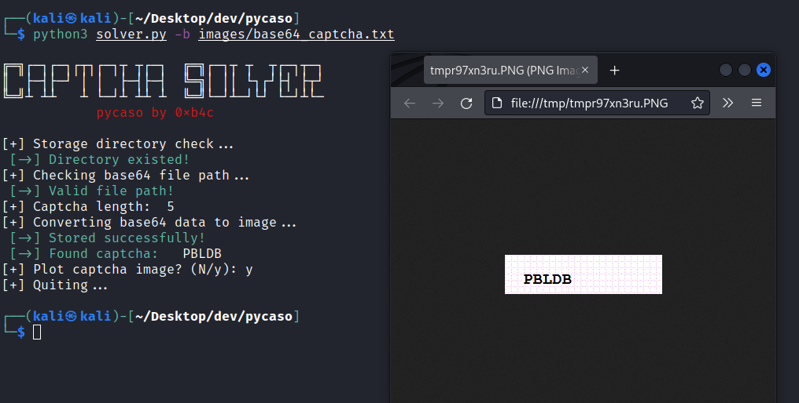
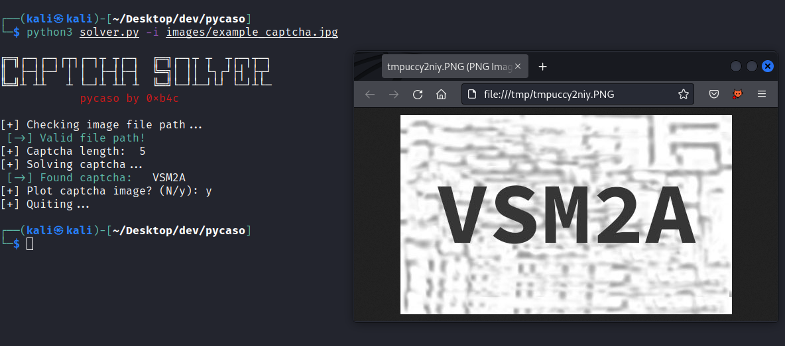

# pycaso - SIMPLE OCR-BASED CAPTCHA SOLVER

## Description

`pycaso` allows to solve simple captcha from URL, image file or from base64 string. This tool uses OCR (optical character recognition) method to extract text from images, based on python's tesseract package.


## Requirement
- Tested on Python 3.6
- Python modules: `Pillow`, `pytesseract`, `requests`

```
pip3 install -r requirements.txt 
```
## Usage
### 0. Help
```
python3 solver.py --help
```
### 1. Solve captcha from specific URL
```
python3 solver.py -u <URL>
```

### 2. Solve captcha from base64 string
```
python3 solver.py -b <base64-image-file-path>
```

### 3. Solve captcha from local captcha image
```
python3 solver.py -i <local-image-file-path>
```

## Examples:
* Solve captcha from specific URL



* Solve captcha from base64 string



- Solve captcha from local captcha image


